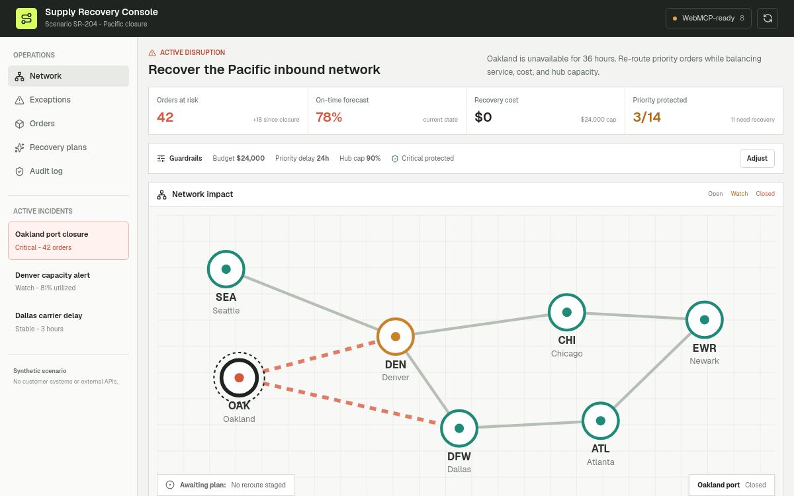
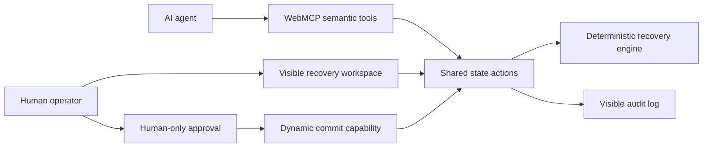

# Supply Recovery Console

A human-agent control room for recovering a supply network after a critical disruption. The application exposes a bounded, semantic WebMCP tool surface so an AI agent can analyze the incident, stage recovery plans, compare tradeoffs, and request review while a human operator retains the approval boundary.

Built for the 2026 WebMCP Challenge.

## Live demo

https://supply-recovery-console.kkrr555666.chatgpt.site



## Why WebMCP

Supply recovery is a shared-state problem. An agent needs structured access to the same incident, constraints, orders, plans, and network state that the operator sees. Screen clicking is brittle and hides intent. A generic chat panel cannot make plan state, approval, or rollback visible and auditable.

This project uses imperative WebMCP tools to provide:

- Semantic operations instead of DOM-level clicks.
- Concise, structured results after visible state updates.
- Dynamic capability registration based on workflow state.
- An explicit human-only approval boundary before commit.
- Full attribution in a shared audit timeline.
- A deterministic simulator with no API keys or external services.

## Product flow

1. Inspect the 36-hour Oakland terminal closure.
2. Review critical and priority orders at risk.
3. Set budget, service-delay, capacity, and critical-order guardrails.
4. Draft or compare recovery strategies.
5. Stage one plan for human review.
6. Approve the exact change set in the visible interface.
7. Commit the approved plan through the dynamically registered tool.
8. Inspect the resulting network and audit history.
9. Revert the commit with the dynamically registered undo tool.

All company names, orders, metrics, and operational events are synthetic.

## AI assistance disclosure

The entrant directed the product scope and submission. OpenAI Codex was used as the coding agent for implementation, testing, documentation, and deployment preparation. The application does not use an LLM backend or generate simulated metrics at runtime; the recovery engine is deterministic and inspectable in this repository.

## WebMCP tools

| Tool | Mode | Purpose |
| --- | --- | --- |
| `get_scenario_status` | Read | Returns incident, constraints, phase, selected plan, and headline metrics. |
| `inspect_disruption` | Read | Returns cause, duration, affected routes, and impact. |
| `list_at_risk_orders` | Read | Returns a filtered order sample. Output is marked as untrusted content. |
| `set_recovery_constraints` | Stage | Updates visible operating guardrails and recalculates drafts. |
| `draft_recovery_plan` | Stage | Simulates one bounded strategy. |
| `compare_recovery_plans` | Read | Returns comparable metrics and opens the visible comparison. |
| `focus_network_entity` | Navigate | Focuses a node or order in the shared workspace. |
| `request_human_approval` | Stage | Opens review without approving or committing. |
| `commit_approved_plan` | Commit | Registered only after explicit human approval. |
| `undo_last_commit` | Undo | Registered only after a committed plan exists. |

The ChatGPT implementation supports the imperative API, so tools are registered from the top-level document with `document.modelContext.registerTool()` and removed with `AbortController` when their lifecycle ends.

## Human control and safety

- The agent cannot approve its own plan.
- Approval requires a human checkbox acknowledging service, cost, and capacity impact.
- Approval and commit are separate actions.
- `commit_approved_plan` does not exist before approval.
- `undo_last_commit` replaces the commit tool after execution.
- Active commits block new constraints and drafts until reverted or reset.
- Read tools use `readOnlyHint`.
- Order output uses `untrustedContentHint`.
- Invalid identifiers, schemas, states, and bounds fail with actionable error messages.
- Every tool call and human action is added to the visible audit log.

## Deterministic simulation

Four strategies run against the same guardrails:

- Balanced recovery
- Service first
- Cost guarded
- Resilience split

The engine adjusts costs, service, delay, utilization, actions, tradeoffs, and violations when constraints change. This keeps the demo reliable while still producing meaningful scenario differences.

## Local development

Requirements: Node.js 22.13 or newer.

```bash
npm install
npm run dev
```

Open the local URL printed by the development server. WebMCP tools require a supported browser context such as the ChatGPT in-app browser or a compatible Chromium build.

## Validation

```bash
npm test
npm run lint
npm run build
```

The test suite covers deterministic output, strategy ranking, critical-order protection, delay tightening, capacity splitting, budget violations, service/cost tradeoffs, bounded order filtering, and case-insensitive lookup.

WebMCP contract validation was also performed in a supported browser context. The validation confirmed tool discovery, schemas, annotations, visible-state updates, dynamic commit registration after human approval, and successful approved-plan execution.

## Architecture



## License

MIT. See `LICENSE`.
